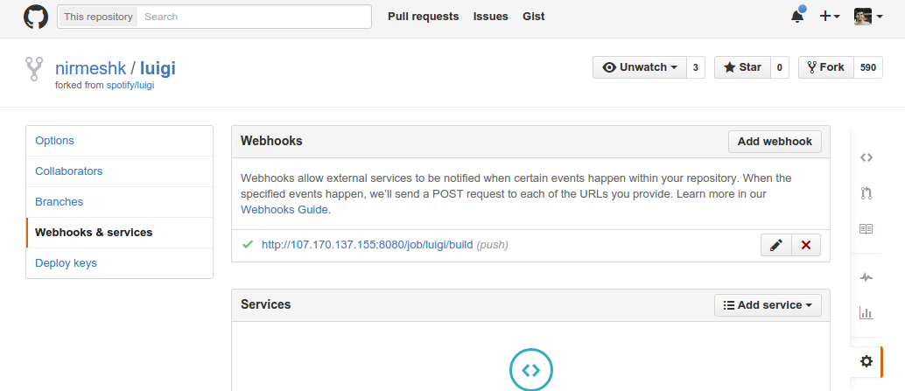
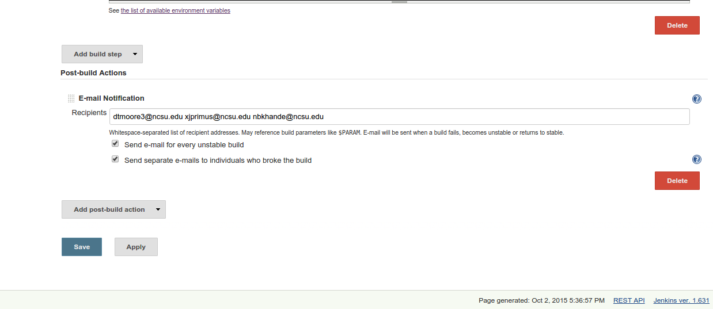
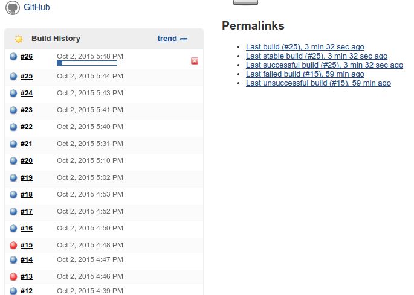

### Team
- Nirmesh Khandelwal (nbkhande@ncsu.edu)
- Xavier Primus (xjprimus@ncsu.edu)
- Trey Moore (dtmoore3@ncsu.edu)

### Provision & Set Up Jenkins Server
Before we use our build management tools, we need to set up a server to handle the Github webhooks and and make sure that all the required dependencies are installed on the server. For this milestone, we elected to use Jenkins CI server to manage the builds after any repository changes. To provision a server on Digitalocean, navigate to the setup folder to run <code>provisionServers.js</code> and then run <code>buildInventory.js</code> to generate a file with the public IP address of the server. You can then ssh into your new droplet on a machine with an authorized key pair. Once you are in the server, simply run the <code>installJenkins.sh</code> file to initialize your build management environment


### Build section

#### The ability to trigger a build in response to a git commit via a git hook.
- We achieved this using github webhooks. Once you finish setting up Jenkins server, we can trigger the build by url, using the “Trigger builds remotely” option in the “Build Triggers” section of job configuration. 
- 

#### The ability to execute a build job via a script or build manager (e.g., shell, maven), which ensures a clean build each time.:
- In Jenkins we set up a build script with the following commands to ensure clean build:
```shell
#!/bin/bash
echo ${GIT_BRANCH#*/}
rm -rf ../virtual_env/
virtualenv ../virtual_env
source ../virtual_env/bin/activate
python setup.py install
pip install tornado tox
tox -e py27-nonhdfs
```
- As you can see, every time a build is triggered, we create a fresh python virtualenv, install all the dependencies in clean environment and run all the unit test cases.

#### The ability to determine failure or success of a build job, and as a result trigger an external event (run post-build task, send email, etc).
- We have configured Jenkins to send the failure reports via email.
- 

#### The ability to track and display a history of past builds (a simple list works) via http.
- This is supported by Jenkins
- 
