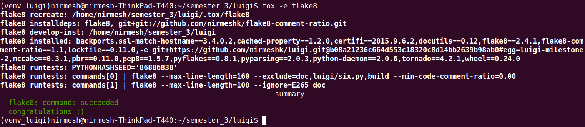
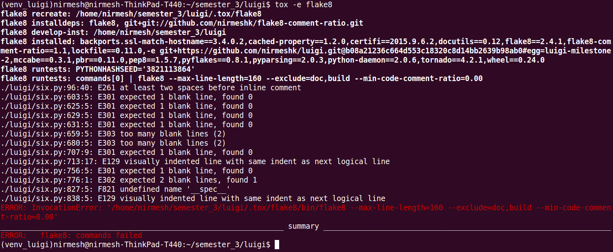

### Team
- Nirmesh Khandelwal (nbkhande@ncsu.edu)
- Xavier Primus (xjprimus@ncsu.edu)
- Trey Moore (dtmoore3@ncsu.edu)

#### Milestone-2

Unit Tests and Coverage - 20%
--------------------------------

- Here is the coverage report of the project. 
- In order to generate this, run `tox -e py27-nonhdfs`

```
Name                                   Stmts   Miss  Cover   Missing
--------------------------------------------------------------------
bin/luigi                                  8      0   100%
examples/dynamic_requirements             36     20    44%   35, 38-44, 58, 61-63, 77, 81-92, 96
examples/elasticsearch_index              24      8    67%   44-49, 59, 112, 115
examples/execution_summary_example        49     17    65%   58, 66, 69-70, 79, 82-83, 91, 94, 103, 106-107, 114, 117-120
examples/foo                              25     10    60%   30, 33-34, 42-43, 52-53, 57-60
examples/foo_complex                      35     16    54%   34, 38-40, 49-50, 55-59, 68-69, 73-76
examples/ftp_experiment_outputs           34     20    41%   44, 50-54, 71, 81, 84-101, 105
examples/hello_world                       7      2    71%   8, 11
examples/pyspark_wc                       25      6    76%   42, 45, 48, 83, 86, 89
examples/spark_als                        29      9    69%   43-47, 57, 86, 96, 107
examples/ssh_remote_execution             30     15    50%   45, 51-52, 72, 75-89, 99, 103
examples/terasort                         44     19    57%   29-37, 62, 65, 68, 72, 93, 103, 106, 109, 112, 116
examples/wordcount                        22     12    45%   37, 51, 61, 68-80
examples/wordcount_hadoop                 20      7    65%   46, 68, 78, 81-82, 85, 88
luigi/__main__                             3      0   100%
luigi/cmdline                             30      3    90%   29-30, 40
luigi/cmdline_parser                      62      0   100%
luigi/configuration                       56      6    89%   38-39, 56-57, 74, 95
luigi/contrib/bigquery                   171    113    34%   28-31, 65, 69, 82-90, 99-107, 115-127, 138-146, 156-159, 170-173, 184-195, 204-216, 228-242, 261-281, 286-289, 298, 301, 304, 313, 320, 327, 331, 336, 339-373, 383, 388, 393, 398, 401-431
luigi/contrib/esindex                    135     90    33%   99-102, 138-148, 161-162, 172-180, 186-193, 199-200, 207-220, 256, 263, 271, 280, 287, 294, 301, 308, 315, 322, 329, 336, 343, 351-353, 362-378, 381, 396-398, 404-406, 412, 420, 445-461
luigi/contrib/ftp                        130    100    23%   44-48, 54-61, 71-85, 93-124, 136-148, 152-178, 182-193, 210-211, 214, 218, 232-239, 243, 257-269, 272, 275, 278
luigi/contrib/gcs                        263    204    22%   28-29, 39-43, 49, 73-79, 112-121, 124-127, 130, 133, 136-143, 146-157, 160-191, 194-198, 201-217, 220-244, 247-253, 256-261, 264-272, 275-305, 311-312, 319-327, 330-367, 372-378, 381, 384, 387, 396-397, 400, 407-412, 415-420, 456-465, 468-469
luigi/contrib/hadoop                     546    412    25%   39-40, 84, 88-92, 96-116, 123-189, 203-208, 214, 217-219, 222-227, 230-232, 238-241, 257-334, 348-372, 390-401, 404-520, 524-526, 529, 538-540, 554, 557-560, 563-572, 575-607, 627, 629, 633, 639, 643-647, 661, 677, 680, 687-698, 719-724, 728, 732, 736, 739, 742, 745, 748, 759-766, 773-774, 783-795, 803, 813-828, 834-838, 848-854, 857, 870, 873-875, 878-892, 900-908, 919-925, 931-937, 943-949, 955-958, 961-964, 971-972, 978-979
luigi/contrib/hadoop_jar                  71     13    82%   45-52, 79, 100, 107-109, 115, 144
luigi/contrib/hdfs/abstract_client        40     16    60%   39, 57-61, 65, 69, 73, 80, 84, 88, 92, 96, 101, 105
luigi/contrib/hdfs/clients                25      4    84%   39, 41, 45, 50
luigi/contrib/hdfs/config                 55     23    58%   33-34, 88-93, 106-139
luigi/contrib/hdfs/error                   8      5    38%   27-36
luigi/contrib/hdfs/format                 94     49    48%   14, 31-35, 38-41, 44-45, 54-57, 60-63, 66-67, 76, 79, 82, 85, 94, 97, 101, 104, 117, 123, 126, 129, 132, 139-147, 150-157
luigi/contrib/hdfs/hadoopcli_clients     167    128    23%   47-52, 65-69, 76-88, 91-98, 101-110, 113-117, 120-129, 132-141, 144, 147, 150, 153-157, 160-172, 176-214, 217, 229-235, 238-247, 259-267
luigi/contrib/hdfs/snakebite_client      102     75    26%   45-47, 51-57, 63-82, 92-95, 107-112, 125-130, 144, 158-160, 179-185, 195-202, 209, 215, 226, 243-247, 272-288, 294
luigi/contrib/hdfs/target                 89     53    40%   36-37, 52, 55-74, 91, 97, 101, 104-107, 110-116, 119, 127-131, 139, 153-156, 162-178, 181-187
luigi/contrib/hive                       243     70    71%   33, 98, 105, 113, 118, 129, 181-187, 192, 209-210, 222-240, 243, 269, 295, 298-302, 304, 306, 334-335, 342, 348-351, 370, 382-385, 388, 401, 410-419, 426-429, 432, 446-452
luigi/contrib/mysqldb                     54     41    24%   27-28, 54-64, 74-89, 92-108, 111-117, 125-145
luigi/contrib/pig                        112     29    74%   90, 96, 138-153, 175-180, 184, 196-201
luigi/contrib/pyspark_runner              23      4    83%   33-34, 56-57
luigi/contrib/rdbms                       36     14    61%   48, 52, 56, 60, 64, 87-96, 106, 120, 124
luigi/contrib/redis_store                 30     15    50%   60-68, 79, 87-92, 98
luigi/contrib/redshift                   136     55    60%   33, 77, 84, 91, 104, 114, 123-128, 141-159, 167, 173-175, 177-178, 194, 263, 273, 280, 331, 356, 360, 364, 368, 375, 384, 396-429
luigi/contrib/scalding                   153     25    84%   93, 111, 136, 141, 144, 148, 153-159, 163-164, 166-167, 222, 244-246, 254, 284, 301-302
luigi/contrib/sge                        121     88    27%   100-101, 115-117, 127-138, 149, 154-155, 187-196, 201-218, 221-222, 233, 237-245, 250-272, 275-301, 313
luigi/contrib/sge_runner                  39     28    28%   39-40, 48-56, 60-74, 80-89, 92
luigi/contrib/spark                      355     38    89%   33-34, 65, 329, 346-349, 360, 365-366, 391, 394, 397, 400, 404, 407, 410, 416, 430-435, 448, 465, 486-487, 490, 493, 496, 500-503, 519, 550, 553, 579
luigi/contrib/sparkey                     21     14    33%   41, 44, 47-63
luigi/contrib/sqla                       116      6    95%   223, 266, 284, 288, 340-341
luigi/contrib/ssh                        200    123    39%   61, 78, 82, 85, 98, 102, 108, 115, 135, 145-157, 163, 169-176, 179-184, 190-197, 203-208, 211-229, 232-251, 255-262, 266-273, 279-289, 293-300, 303-304, 308, 312, 323-327, 331, 334-348, 351, 354
luigi/contrib/target                      31      0   100%
luigi/contrib/webhdfs                     94     57    39%   46-52, 55-63, 71-73, 76-78, 81-82, 85, 88, 91-99, 102, 111-112, 115-116, 122-127, 130-134, 138, 144-151, 154, 157, 161, 165
luigi/date_interval                      135     14    90%   42, 98, 112, 115, 118-119, 125-129, 133, 138, 143, 148, 199
luigi/db_task_history                    115     17    85%   65, 70-72, 117, 149-151, 162-163, 169-170, 176-177, 190, 204, 227
luigi/deprecate_kwarg                     15      0   100%
luigi/event                               10      0   100%
luigi/execution_summary                  223      7    97%   101-103, 202, 281, 333-334
luigi/file                                92     10    89%   59-62, 69, 96, 121, 125, 128, 132, 139
luigi/format                             314     42    87%   97, 133-138, 142, 148, 151-152, 186-187, 190-191, 205, 211, 222, 225, 229, 256, 280, 283, 290, 298-303, 311, 330, 346, 350, 366-367, 369, 373, 419-420, 424, 487, 513, 517
luigi/hadoop                               4      0   100%
luigi/hadoop_jar                           4      0   100%
luigi/hdfs                                 4      0   100%
luigi/hive                                 4      0   100%
luigi/interface                          101      4    96%   152, 163, 169, 206
luigi/lock                                46      3    93%   49, 92, 102
luigi/mock                               101     12    88%   64, 74, 80, 105-108, 128, 139, 159, 162, 165
luigi/notifications                      137     31    77%   62-65, 81-82, 88, 105, 111, 119-124, 130-145, 153, 155-156, 169, 171, 239
luigi/parameter                          209     11    95%   28-29, 158, 215, 266, 276, 305, 313, 374, 472-477
luigi/postgres                           131     92    30%   36-37, 125-134, 144-166, 169-185, 191-198, 206-228, 231, 250-252, 260-263, 273, 283-289, 299-344
luigi/process                             59      9    85%   36, 46, 69-72, 80, 111-112
luigi/rpc                                108     10    91%   46-47, 115, 133, 178, 181, 184, 194, 197, 200
luigi/s3                                 298     48    84%   30-31, 35-36, 52-53, 145-154, 236-242, 248-261, 267-268, 323, 348, 391, 393, 476, 522-531, 534-535, 544-545, 565, 576
luigi/scalding                             4      0   100%
luigi/scheduler                          602     24    96%   27-28, 109, 150, 198, 302-303, 344-345, 358, 394, 397, 451, 475, 527-528, 663, 668, 876-877, 997, 1008-1009, 1014
luigi/server                             148     60    59%   93, 99-106, 112-145, 150-164, 170-171, 177-178, 184-185, 191-194, 202-210, 238, 241, 286, 300
luigi/target                              69     11    84%   51, 105, 115, 136, 146, 158, 186, 200, 210, 220, 245
luigi/task                               207     16    92%   25-26, 138, 161-164, 481, 490-491, 530-533, 538-539
luigi/task_history                        27      3    89%   52, 56, 60
luigi/task_register                       97      3    97%   88, 111, 118
luigi/task_status                          8      0   100%
luigi/tools/deps                          48     31    35%   52, 56-63, 80, 87-92, 96-110, 115
luigi/tools/luigi_grep                    58     44    24%   14-15, 19, 23-25, 28-36, 40-44, 48-53, 57-80, 83
luigi/tools/parse_task                    18      0   100%
luigi/tools/range                        227     11    95%   112-113, 118, 121, 128, 135, 142, 184, 186, 188, 446
luigi/util                               102      1    99%   29
luigi/webhdfs                              4      0   100%
luigi/worker                             468     28    94%   36-37, 164, 196-199, 206-207, 407-408, 411-412, 415-416, 420-422, 488, 509, 548, 570, 572, 661, 711, 752, 800-801
--------------------------------------------------------------------
TOTAL                                   8396   2604    69%

```

Advanced Testing Technique - 20%
--------------------------------
- For increased code coverage we employed the use of a python fuzzing library named [Hypothesis](http://hypothesis.readthedocs.org/en/latest/) . It works by letting you write tests that assert that something should be true for every case, not just the ones you happen to think of.
    + 

Base Analysis - 20%
--------------------
- In order to run the base analysis, the project uses flake8. 
- flake8 is a wrapper around
    + PyFlakes (For finding bugs)
    + pep8 (for Style guide violations)
    + Ned Batchelder’s McCabe script (for cyclometic complexity)
- In order to run the flake8 analysis, run `tox -e flake8`

- Output:
- 
- Output with some warnings
- 

Extended Analysis - 10%
-------------------------

Testing Gate - 10%
--------------------

Analysis Gate - 10%
--------------------
- 
- We made a pre-push hook that runs all the tests and rejects the push if the code coverage falls below a given value.

Security Token Gate - 10%
-------------------------
We've included the pre-commit hook below to prevent developers from committing AWS credentials, Digital Ocean keys and .pem files for ssh access: 
